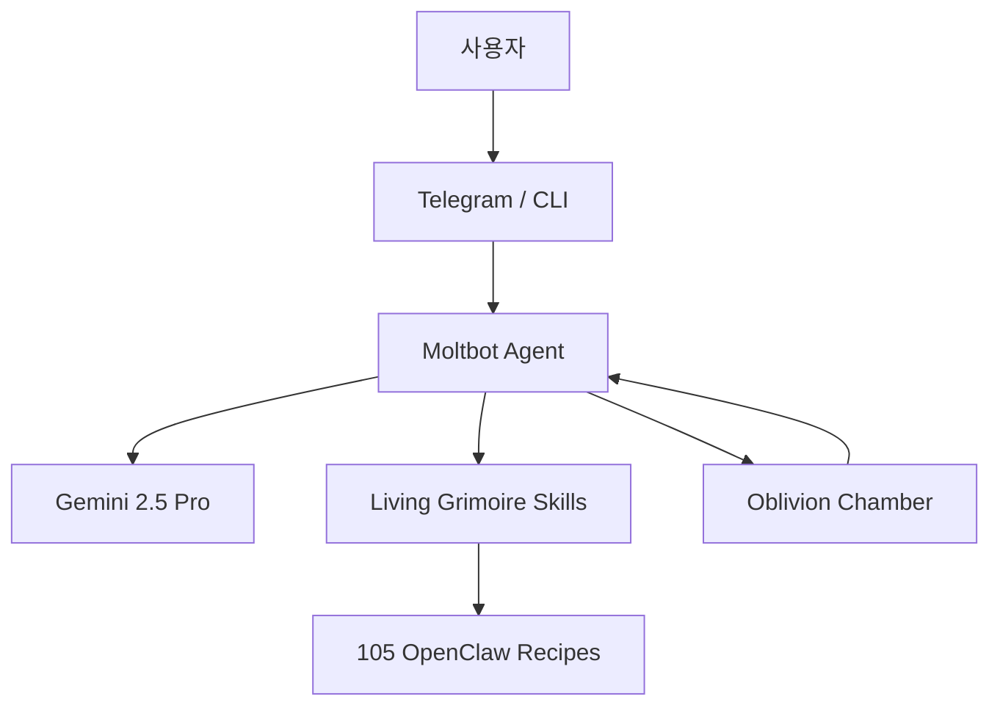

<div align="center">

# Darlbit Claw

### *Reflective Intelligence OS*

**Moltbot AI Agent · OpenClaw 105 Recipes · Telegram/CLI**

[](https://ai.google.dev)
[](AGENTS.md)
[](OpenClaw_105_Recipes.md)
[](LICENSE)

> **"달빛 아래 사색하는 AI — Reason of Moon의 핵심 지능 시스템"**
> Moltbot이 Oblivion Chamber에서 진화하며, Living Grimoire 스킬로 사용자를 보조합니다

</div>

---

## 🧠 Philosophy

| 기준 | 일반 챗봇 | Darlbit Claw |
|------|----------|--------------|
| 정체성 | 범용 AI | **Moltbot: 달빛의 파트너** |
| 지식 | 학습 데이터 고정 | **Living Grimoire + 105 레시피** |
| 진화 | 없음 | **Oblivion Chamber 기반 자기 진화** |
| 채널 | 웹 전용 | **Telegram + CLI (TUI)** |



## ⚙️ System Layers

### Layer 1 · Moltbot Agent Core
Gemini 2.5 Pro 기반, Claude/GPT-4o 폴백 지원

### Layer 2 · OpenClaw 105 Recipes
105가지 사전 정의된 작업 레시피 (자동화, 분석, 생성)

### Layer 3 · Reflective Intelligence Dashboard
`index.html` — 우주 테마 대시보드 (에이전트 상태, 메모리, 스킬 관리)

## 🎯 Getting Started

```bash
git clone https://github.com/Reasonofmoon/darlbit-claw.git
# index.html을 브라우저에서 열어 대시보드 확인
# Telegram 봇 연동은 AGENTS.md 참조
```

## 📁 Project Structure

```
darlbit-claw/
├── index.html                    # Reflective Intelligence 대시보드
├── AGENTS.md                     # Moltbot 설정 + 모델 정보
├── OpenClaw_105_Recipes.md       # 105 레시피 목록
├── ROADMAP.md                    # 개발 로드맵
├── agents/                       # 에이전트 모듈
├── skills/                       # Living Grimoire 스킬
├── scripts/                      # 자동화 스크립트
├── workspace/                    # 작업 공간
├── assets/                       # 정적 리소스
└── docs/                         # 문서
```

## 📊 Numbers

| 항목 | 수치 |
|------|------|
| AI 모델 | Gemini 2.5 Pro + 2 폴백 |
| OpenClaw 레시피 | 105개 |
| 채널 | Telegram + CLI |

## 📄 License

MIT License

<div align="center">
<br>

**Darlbit Claw** · 달빛 아래 사색하는 AI

Made by [Reason of Moon](https://github.com/Reasonofmoon)

</div>
