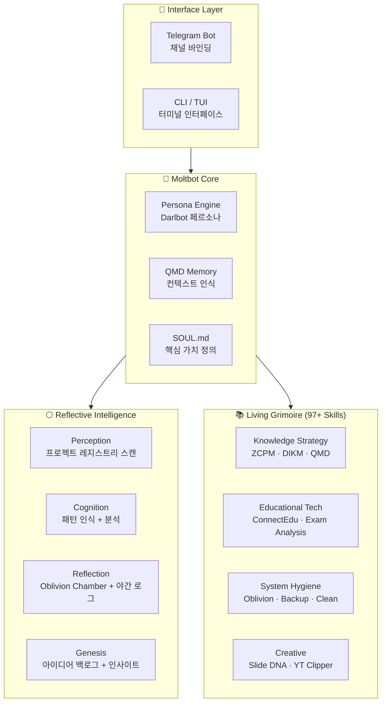

<div align="center">

# 🌕 Darlbit Claw

**Reflective Intelligence OS — Moltbot AI Agent · OpenClaw 105 Recipes · Living Grimoire**

달의 이성(Reason of Moon) 플랫폼의 핵심 두뇌: 반성적 지능 시스템

[](https://ai.google.dev/)
[](skills/)
[](OpenClaw_105_Recipes.md)
[](AGENTS.md)
[](AGENTS.md)
[](LICENSE)

</div>

---

## 🤔 Philosophy — 왜 Darlbit Claw인가?

| 일반 AI CLI Agent | Darlbit Claw (Moltbot) |
|:---:|:---:|
| 기능적 유틸리티 도구 | **반성적 지능(Reflective Intelligence) 시스템** |
| 명령 → 실행 단순 루프 | **Oblivion Chamber로 실패에서 학습** |
| 정적 스킬셋 | **Living Grimoire — 97+ 진화하는 스킬** |
| 단일 모델 | **Gemini 2.5 Pro + Claude + GPT-4o 폴백** |
| 대화 기록 없음 | **QMD 메모리 + 야간 반성 시스템** |

> *"달은 밤에 데이터를 분석하고 지혜를 생산합니다 — Moltbot은 '생각의 파트너'입니다."*

---

## 🏗️ Architecture — 시스템 구조



---

## ✨ Features — 기능 레이어

### 🌕 Layer 1 · Reflective Intelligence System
| 기능 | 설명 | Wow Moment |
|:---|:---|:---|
| Perception | 프로젝트 레지스트리 자동 스캔 | 워크스페이스 전체를 **자동 인식** |
| Cognition | 패턴 인식 + 데이터 분석 | proven/anti 패턴 **자동 분류** |
| Reflection | Oblivion Chamber + 야간 반성 로그 | 실패에서 **자동 학습** |
| Genesis | 아이디어 백로그 + 기회 발견 | 인사이트 **자동 생성** |

### 🤖 Layer 2 · Moltbot Agent
| 기능 | 설명 | Wow Moment |
|:---|:---|:---|
| Multi-Model | Gemini 2.5 Pro / Claude / GPT-4o 폴백 | 최적 모델 **자동 선택** |
| QMD Memory | 컨텍스트 인식 메모리 시스템 | 대화 맥락 **영구 보존** |
| SOUL.md | 에이전트 핵심 가치 + 페르소나 | 일관된 성격 **유지** |
| Telegram + CLI | 듀얼 채널 바인딩 | 어디서든 **즉시 접근** |

### 📚 Layer 3 · Living Grimoire (97+ Skills)
| 도메인 | 스킬 예시 | Wow Moment |
|:---|:---|:---|
| Knowledge Strategy | ZCPM, DIKM, QMD Search | 지식 **체계적 관리** |
| Educational Tech | ConnectEdu, Exam Analysis, Curriculum | 교육 도구 **통합** |
| System Hygiene | Oblivion Chamber, Backup, Clean Modules | 시스템 **자가 치유** |
| Creative | Slide DNA, YouTube Clipper, MoonLang | 콘텐츠 **자동 생성** |
| Discovery | Cross-Pollinator, Serendipity Scout | 우연한 발견 **촉진** |

---

## 🚀 Quick Start

### 🟢 Starter — 구조 탐색
```bash
git clone https://github.com/Reasonofmoon/darlbit-claw.git
cd darlbit-claw

# 대시보드 열기
open index.html

# 105가지 레시피 확인
cat OpenClaw_105_Recipes.md
```

### 🔵 Pro — Moltbot 활성화
```bash
# AGENTS.md에서 Gemini API 키 설정
# workspace/SOUL.md에서 페르소나 커스터마이징
# 야간 반성 시스템 실행
powershell scripts/nightshift.ps1
```

### 🟣 Enterprise — 풀 시스템 운영
```bash
# Telegram Bot 연동
# skills/ 폴더에서 커스텀 스킬 추가
# workspace/genesis/에서 인사이트 파이프라인 가동
```

---

## ⚙️ Customization — 커스터마이징 가이드

| 우선순위 | 파일 위치 | 설명 | 난이도 |
|:---|:---|:---|:---:|
| **1st** | `AGENTS.md` | 모델 설정 + API 키 | ⭐ |
| **2nd** | `workspace/SOUL.md` | 에이전트 페르소나 수정 | ⭐⭐ |
| **3rd** | `skills/*/SKILL.md` | 커스텀 스킬 추가/수정 | ⭐⭐ |
| **4th** | `workspace/MEMORY.md` | 메모리 컨텍스트 조정 | ⭐⭐ |
| **5th** | `scripts/nightshift.ps1` | 야간 반성 스케줄 커스텀 | ⭐⭐⭐ |

---

## 📂 Project Structure

```
darlbit-claw/
├── AGENTS.md                     # Moltbot 에이전트 설정 (모델·채널)
├── OpenClaw_105_Recipes.md       # 105가지 실전 레시피
├── ROADMAP.md                    # 개발 로드맵
├── index.html                    # Reflective Intelligence 대시보드
│
├── docs/
│   ├── architecture/             # 4-Layer 아키텍처 문서
│   │   ├── overview.md           # 전체 구조
│   │   ├── perception.md         # 인식 레이어
│   │   ├── cognition.md          # 인지 레이어
│   │   ├── reflection.md         # 반성 레이어
│   │   └── genesis.md            # 생성 레이어
│   └── Reason_of_Moon_Manual.md  # 플랫폼 매뉴얼
│
├── skills/                       # Living Grimoire 스킬셋
│   ├── cross-pollinator/         # 교차 수분 스킬
│   ├── genesis-synthesizer/      # 아이디어 합성
│   ├── nightshift/               # 야간 반성
│   ├── serendipity-scout/        # 우연 발견
│   ├── yt-dlp/                   # 영상 처리
│   └── _template/SKILL.md        # 스킬 템플릿
│
├── workspace/                    # Moltbot 워크스페이스
│   ├── MEMORY.md / SOUL.md       # 메모리 + 영혼
│   ├── perception/               # 프로젝트 레지스트리
│   ├── cognition/                # 패턴 분석
│   ├── reflection/               # 야간 로그 + Oblivion Archive
│   └── genesis/                  # 아이디어 백로그 + 인사이트
│
├── scripts/                      # 자동화 스크립트 (PowerShell)
│   ├── nightshift.ps1            # 야간 반성
│   ├── scan_workspace.ps1        # 워크스페이스 스캔
│   └── generate_registry.ps1     # 레지스트리 생성
│
└── assets/images/                # 아바타 + 배경 이미지
```

---

## 📊 Numbers

| 지표 | 수치 |
|:---|:---|
| **AI 스킬** | 97+ (Living Grimoire) |
| **실전 레시피** | 105가지 |
| **아키텍처 레이어** | 4 (Perception · Cognition · Reflection · Genesis) |
| **AI 모델** | Gemini 2.5 Pro + Claude + GPT-4o |
| **채널** | Telegram + CLI (TUI) |
| **메모리 시스템** | QMD (Zettelkasten-based) |

---

## 📋 Requirements

| 도구 | 버전 |
|:---|:---|
| PowerShell | 7+ |
| Gemini API Key | 필수 |
| Node.js | 18+ (웹 인터페이스) |
| Telegram Bot Token | 선택 |

---

## 🤝 Contributing

1. Fork this repository
2. Create your feature branch (`git checkout -b skill/new-skill`)
3. Add skill in `skills/your-skill/SKILL.md`
4. Commit your changes (`git commit -m 'feat: add new skill'`)
5. Push and open a Pull Request

---

## 📄 License

This project is licensed under the **MIT License** — see the [LICENSE](LICENSE) file for details.

---

<div align="center">

**Darlbit Claw** · 달빛 아래 사색하는 AI, 반성하는 지능

Made by [Reason of Moon](https://github.com/Reasonofmoon)

</div>
